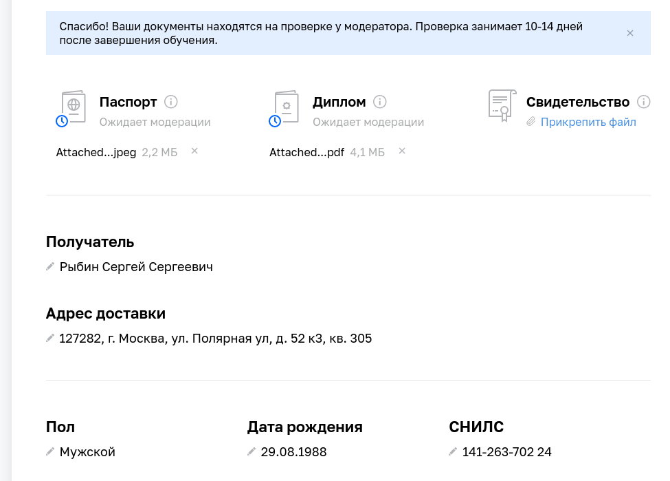

# podg_dip_RybinSS

### Задание 1

Что нужно сделать:

1.  1. Получилось ли у вас загрузить в личный кабинет документы, подтверждающие личность, и диплом о высшем или среднем специальном образовании?  

   

2.  Нужна ли вам справка об обучении после сдачи дипломной работы? Справка выдаётся всем студентам, в том числе тем, у кого нет диплома о высшем или среднем специальном образовании.  
ДА  
3.  Выполнен ли вами необходимый минимум заданий на каждом модуле профессии для допуска к дипломной работе?  
ДА  

